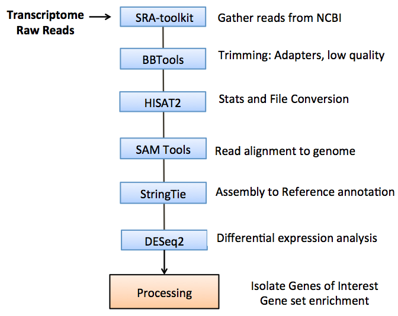
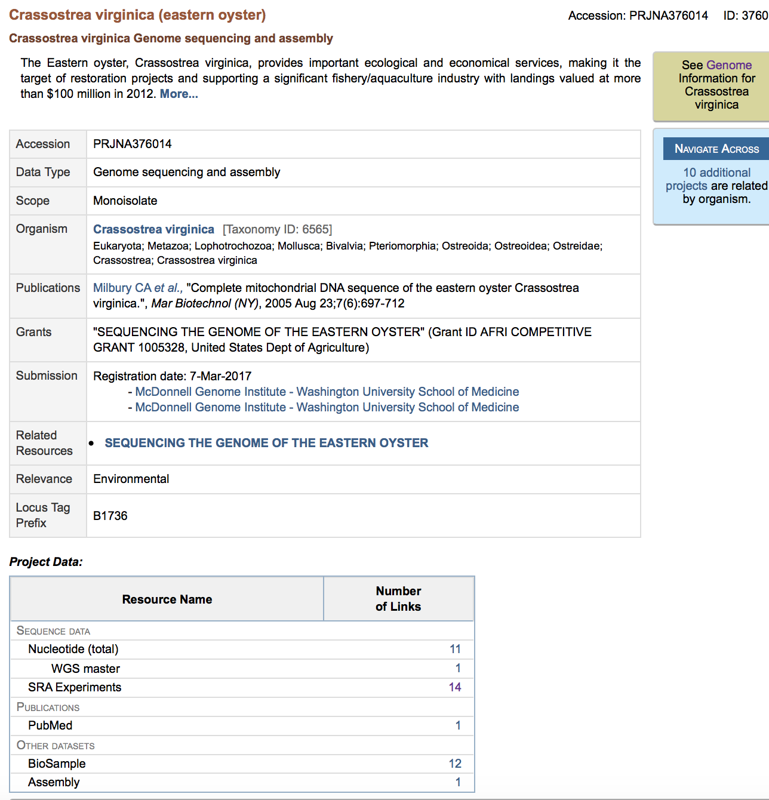
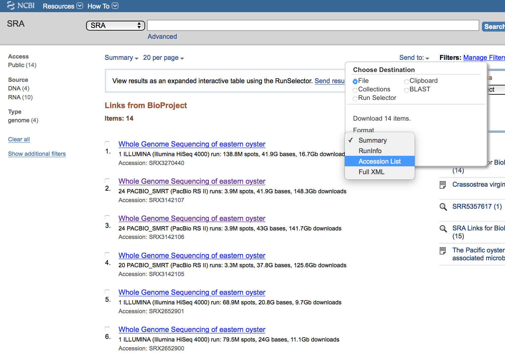

# Introduction

This markdown walks users through the data analysis pipeline I used to analyze differential expression of apoptosis genes from transcriptomes gathered following challenge of oysters with the Virus OsHV-1, strains of Vibrio sp., and probiotic. For simplicity, this tutorial only analyzes 6 transcriptomes, from NCBI Samples SRR5357617, SRR5357618, SRR5357619, SRR5357622, SRR5357623, SRR5357626. Three control samples were used and three probiotic samples were used. Codes used for all other analyses are available in the DESeq2 folder in this repository. For any further questions, please email me at erin_roberts@my.uri.edu. 

## The Data 

Sample ID  | SRA Experiment | Experimental Condition | Library Layout | Number Bases   | Organism      | Life Stage |
-----------|----------------|------------------------|----------------|----------------|---------------|------------|
SRR5357617 | SRX2652894     | control                | PE             | 21804530162.00 | C. virginica  | larvae     |
SRR5357618 | SRX2652899     | RIF                    | PE             | 20356460396.00 | C. virginica  | larvae     |
SRR5357619 | SRX2652896     | RIF                    | PE             | 22691300916.00 | C. virginica  | larvae     |
SRR5357622 | SRX2652895     | control                | PE             | 22956419468.00 | C. virginica  | larvae     |
SRR5357623 | SRX2652900     | control                | PE             | 24004328060.00 | C. virginica  | larvae     |
SRR5357626 | SRX2652898     | RIF                    | PE             | 18449441230.00 | C. virginica  | larvae     |


## Overall pipeline 
```{r, out.width="400px", out.height="400px", echo=FALSE, fig.align='center'}

```

## Step 1: Find the data on NCBI

NCBI houses a repository of sequence data in their Sequence Read Archive (SRA). This site stores information from high throughput sequencing platforms. SRA files are often part of a larger data structure in NCBI called BioProjects, which are a collection of bioligical data related to a single project. The BioProject record can store several different data types relevant to an experiment. There are often several "SRA Experiments" in a single BioProject. 

The NCBI page for the project to sequence the whole genome of eastern oyster is shown below. 14 SRA experiments are included. 
```{r, out.width="400px", out.height="400px", echo=FALSE, fig.align='center'}

```

Sadly, we cannot directly download the SRA data from this page. We need to click on the linked number *14* next to *SRA Experiments*. This takes us to this page. We first use the check box next to each to select which experiments we are interested in. To populate a list with the list of the Accessions we click *Send to* > *Format* > *Accession List* which produces a text file with the name of all experiments we wish to download.Today however, we will only select the Experiments listed in the table above. 
```{r, out.width="400px", out.height="400px", echo=FALSE, fig.align='center'}

```

## Step 2: Download the data 

To download the SRA data we must use an NCBI tool called the SRA Toolkit. This toolkit can be downloaded [here](https://www.ncbi.nlm.nih.gov/sra/docs/toolkitsoft/). Instructions for installation are provided [here](https://trace.ncbi.nlm.nih.gov/Traces/sra/sra.cgi?view=toolkit_doc&f=std). NCBI also provides a somewhat vague usage guide [here](https://www.ncbi.nlm.nih.gov/sra/docs/sradownload/). The package must be installed and configured. 

The main input you need to give the toolkit is the list of Accessions in a *.txt* file you obtained from the previous step from NCBI. If you are loading more than one SRA at a time, it is much more efficient to write this step as a bash script with loop. The critical commands for downloading the data are `prefetch` and `fastq-dump`. Basically the pre-fetch downloads the data from the server in SRA format and fastq-dump allows you to convert them into fastq format (or sam format if you like, but that's not what we want today). **Note: You need to use slightly different commands for downloading paired end reads or single end reads.**

The commands below assume that the Toolkit functions are either in your `$PATH` environmental variable. If commands are not loaded into your `$PATH` but are loaded into your current workind directory, you must use specificy the working directory explicitly, e.g. `./fastq-dump`. The script I used to download all of my data is called `fetchSRA.sh` and it is in my /SCRIPTS folder and includes additional commands for running this process on a cluster computing environment (where I could load the SRA toolkit as a `module`).

```
#!/bin/bash

# Loop for downloading PE sequences from Accessions in my .txt file

for f in $F/*_paired.text
do 
  prefetch --option-file $f 
  while read -r LINE; do
    fastq-dump -O $F --split-files --readids $LINE 
  done < $f 
done   

echo "STOP $date"
```

## Step 3: Read preprocessing using BBTools

The first critical step in any RNA-seq experiment is preprocessing of raw reads and performing quality control (often referred to as "QCing the reads"). The critical steps in this process are^[1]^:

1. Trim adapter sequences: during the sequence process reads are often multiplexed and given barcode adapters to identify the sequence. These need to be removed in post processing and are of a known lenght and identity.
2. Discard low quality reads: some entire reads have low quality. It is best to discard these. 
3. Remove reads with poor quality: read quality typically decreases towards the 3' end of reads. These low quality bases should be removed. 

There are several popular tools to perform these tasks (like Trimmomatic or CutAdapt). A good program to use for getting overall quality statistics is FASTQC. BBTools is a newer program available through the Joint Genome Institute to peform these tasks, and includes scripts like bbduk and bbmap. The software can be downloaded [here](https://sourceforge.net/projects/bbmap) and a [link to the user guide](https://jgi.doe.gov/data-and-tools/bbtools/bb-tools-user-guide/). Many tools however require that you have prior knowledge of what your adapeter sequences are. However, the adapters used are not often provided with NCBI datasets. BBTools provides an easy workaround because it provides a file called `/bbmap/resources/adapters.fa` with Illumina Truseq and Nextera adapter sequences. Using the bbduk.sh script you can search for all of these common adapters and tell it to trim any it finds. The bbduk.sh script can take many different parameters for customization. I choose to use middle-of-the-road stringency (there is a lot of argument in the literature about how stringent these parameters should be). Following adapter trimming I trimmed reads on both the left and right side of the read with a quality score of less than 20 and discarded reads with an overall quality of less than 10. The final loop of this script generates several histograms to assess the data. The data could have also been assessed via FASTQC. 

I have again chosen to use bash scripts here to create loops that process all the data at each step, generating files that are then used in the following step in the analysis. **NOTE:There are many different ways this could have been coded.** 

Create a bash script via `$ nano bbtools.sh` that contains the following commands below. **NOTE: The `--split-files` option when downloading data with the SRA Toolkit added the *_1.fq* and *_2.fq* **. Run your command afterwards using `$ bash bbtools.sh`. 

```
#!/bin/bash

#Commands for Paired End Read Preprocessing, all files are in the home directory and either have ending 
# _1.fq or _2.fq
# Specify current path (just for extra security)
F=/path/to/folder

#changing PE file endings to fq because the program prefers those endings
for f in *.fastq; do 
  mv -- "$f" "$f.fq"
done

#going to make two array variables and then iterate through them as an index
array1=($(ls $F/*_1.fq))
array2=($(ls $F/*_2.fq))

#Output file that tells you the adapter stats, incase you're interested, output file stats.txt will list the names of adapter sequences found, and their frequency
for i in ${array1[@]}; do  # @ symbol tells it to go through each item in the array  
   bbduk.sh in1=${i} in2=$(echo ${i}|sed s/_1/_2/) k=23 ref=/opt/software/BBMap/37.36-foss-2016b-Java-1.8.0_131/resources/adapters.fa stats=${i}.stat out=${i}.out
done

#Trimming of adaptors found in the previous command
for i in ${array1[@]}; do 
	bbduk.sh in1=${i} out1=${i}.clean in2=$(echo ${i}|sed s/_1/_2/) out2=$(echo ${i}|sed s/_1/_2/).clean ref=/opt/software/BBMap/37.36-foss-2016b-Java-1.8.0_131/resources/adapters.fa ktrim=r k=23 mink=11 hdist=1 tpe tbo
	echo "adapter trimming ${i}" $(date)
done

	#ktrim = r means it will only trim from right side, which is where the adapter should be. (ktrim=l would trim from left)
	#hdist = hamming distance, hdist =1 allows for 1 mismatch
	#flag -tbo specifies to also trim adaptors based on pir overlap detection using BBMerge 
	#which does not require known adapter sequences)
	#flag -tpe specified to trim both reads to the same length (if the adapter kmer was only detected in one of them and not other)

#Quality trimming, of both the left and the right sides to get rid of reads that are less than quality 20
for i in ${array1[@]}; do 
	bbduk.sh in1=${i}.clean out1=${i}.clean.trim in2=$(echo ${i}|sed s/_1/_2/).clean out2=$(echo ${i}|sed s/_1/_2/).clean.trim qtrim=rl trimq=20
 	echo "quality trimming ${i}" $(date)
done

#Quality filtering to get rid of entire low quality reads. maq=10 will trim reads that have average quality of less than 10
for i in ${array1[@]}; do 
	bbduk.sh in1=${i}.clean.trim out1=${i}.clean.trim.filter in2=$(echo ${i}|sed s/_1/_2/).clean.trim out2=$(echo ${i}|sed s/_1/_2/).clean.trim.filter maq=10
	echo "STOP" $(date)
	echo "quality filtering ${i}" $(date)
done

#Histogram generation, only generating for one of the pair (assuming that similar stats will be present). 
#All histogram output contents are combined into one file
for i in ${array1[@]}; do
 	 bbduk.sh in1=${i}.clean.trim.filter in2=$(echo ${i}|sed s/_1/_2/).clean.trim.filter  bhist=${i}.b.hist qhist=${i}.q.hist gchist=${i}.gc.hist lhist=${i}.l.hist gcbins=auto
	 echo "STOP" $(date)
     echo ${i} > ${i}.hist.all
     echo "bhist" >> ${i}.hist.all
     cat ${i}.b.hist >> ${i}.hist.all
     echo "qhist" >> ${i}.hist.all
     cat ${i}.q.hist >> ${i}.hist.all
     echo "gchist" >> ${i}.hist.all
     cat ${i}.gc.hist >> ${i}.hist.all
     echo "lhist" >> ${i}.hist.all
     cat ${i}.l.hist >> ${i}.hist.all 
	 echo "histogram DONE" $(date)
done
		#lhist = output a read length histogram
        #qhist = per base average quality
        #bhist = output a per-base composition histogram
        #gchist = output a gc content histogram
```

## Step 4: Aligning transcriptome reads to the reference eastern oyster genome

Now that our files have been preprocessed it is time to align them to the reference genome. The genome fasta file can be downloaded from NCBI [here](https://www.ncbi.nlm.nih.gov/genome/?term=txid6565[orgn]). Download the **genome** file. There are several popular RNA-seq read aligners, each with different algorithms and pitfalls^[2]^. One of the most popular pipelines however in recent years has been the "Tuxedo Suite" pipeline including **Bowtie** > **TopHat** > and **Cufflinks** (*cute right?*). In this suite Bowtie is a fast short read aligner, TopHat uses information from Bowtie to align short reads to the reference, and Cufflinks performs differential expression analysis. This software was first created in 2009 by Trapnell et al.^[3]^. This pipeline is now outdated and has been replaced by the **HISAT2** > **StringTie** > **Ballgown** Suite by [Pertea et al., 2016](https://search-proquest-com.uri.idm.oclc.org/docview/1815346347?OpenUrlRefId=info:xri/sid:primo&accountid=28991) (*the names aren't as clever IMO*). Software for this full pipeline is available on this site by the [Johns Hopkins University Center for Computational Biology](http://ccb.jhu.edu/software.shtml). Pertea et al. (2016) describe their full pipeline in this paper and include a very helpful tutorial. I recommend going through that if you are interested in using this software. For addition information on the all the parameters available for HISAT2 please read [Kim et al., 2015. HISAT: a fast spliced aligner with low memory requirements](https://www.nature.com/articles/nmeth.3317).

I have chosen to only use the **HISAT2** and **StringTie** from this pipeline, which I'll get into later in this tutorial. For HISAT2 you can choose to either create an index using a reference genome (or transcriptome) with no annotation file, or with an annotation file. If you do not use an annotation file you are allowing for novel transcripts to be discovered in the alignment step. **However, if you choose to use an annotation file in the StringTie step (which we will) you need to make sure the header information between the genome and the annotation file match or this causes errors**.

The overall steps for I've used in running HISAT2 are to:

1. Build an index of the reference genome
2. Align paired end reads to it

Once you have HISAT2 downloaded, create new directory for the HISAT index called genome. Put the genome inside it and copy all read files into this directory as well to ensure easy access by commands. Create a bash script via `$ nano HISAT2.sh` that contains the following commands below. Run your command afterwards using `$ bash HISAT2.sh`. 

```
#!/bin/bash

#Specify working directory 
F=/data3/marine_diseases_lab/erin/Bio_project_SRA/pipeline_files/C_Vir_subset

#Indexing a reference genome and no annotation file (allowing for novel transcript discovery)
#Build HISAT index with Cvirginica genome file (make sure beforehand to remove extra spaces in header so that genome and annotation don't conflict, the header names are important)

hisat2-build -f $F/cvir_edited.fa cvir_edited # -f indicates that the reference input files are FASTA files

#Aligning paired end reads
array1=($(ls $F/*_1.fq.clean.trim.filter))

for i in ${array1[@]}; do
	hisat2 --dta -x $F/cvir  -1 ${i} -2 $(echo ${i}|sed s/_1/_2/) -S ${i}.sam
	echo "HISAT2 PE ${i}" $(date)
done
 	#don't need -f because the reads are fastq
	# put -x before the index
	# --dta : Report alignments tailored for transcript assemblers including StringTie.
	#With this option, HISAT2 requires longer anchor lengths for de novo discovery of splice sites. 
	#This leads to fewer alignments with short-anchors, which helps transcript assemblers improve significantly in computation and memory usage.

```

## Step 5: Convert SAM to BAM with SAMTools

Following alignment of our paired end reads the HISAT output is in SAM (Sequence ALignment Map) format, this is the human readable format. A BAM file is the binary format. The input for StringTie requires this binary format. SAMTools is a suite of programs for working with next-gen sequencing data with many capabilities^[4]^. It can be downlaoded from [sourceforge.net](http://samtools.sourceforge.net). It can sort files for you, index fasta files and retrieve sequences with `faidx`, convert files with `import`, merge sorted alignments with `merge`, allow you to view sequences using the `tview`, among other things. It can also provide useful alignment statistics. Analyzing the quality of your alignment is a very important QC step^[1]^. 

As before, create a bash script containing the following commands. 

```
#!/bin/bash

#SAMTOOLS sort to convert the SAM file into a BAM file to be used with StringTie
#SHOULD NOT PERFORM FILTERING ON HISAT2 OUTPUT
array3=($(ls $F/*.sam))
	for i in ${array3[@]}; do
		samtools sort ${i} > ${i}.bam #Stringtie takes as input only sorted bam files
		echo "${i}_bam"
	done

#Get bam file statistics for percentage aligned with flagstat
# to get more detailed statistics use $ samtools stats ${i}
array4=($(ls $F/*.bam))
	for i in ${array4[@]}; do
		samtools flagstat ${i} > ${i}.bam.stats #get % mapped
	#to extract more detailed summary numbers
		samtools stats {i} | grep ^SN | cut -f 2- > ${i}.bam.fullstat
		echo "STATS DONE" $(date)
	done

```

## Step 6: Assemble reads to the reference annotation using StringTie


[1]: https://genomebiology.biomedcentral.com/articles/10.1186/s13059-016-0881-8 "Conesa et al., 2016. A survey of best practices for RNA-seq data analysis"
[2]: https://www.nature.com/articles/nmeth.4106 "Baruzzo et al., 2016. Simulation-based comprehensive benchmarking of RNA-seq aligners"
[3]: https://www.ncbi.nlm.nih.gov/pubmed/19289445 "Trapnell et al., 2009. TopHat: discovering splice junctions with RNA-Seq."
[4]: https://www.ncbi.nlm.nih.gov/pubmed/21903627 "Li. 2011. A statistical framework for SNP calling, mutation discovery, association mapping and population genetical parameter estimation from sequencing data."
